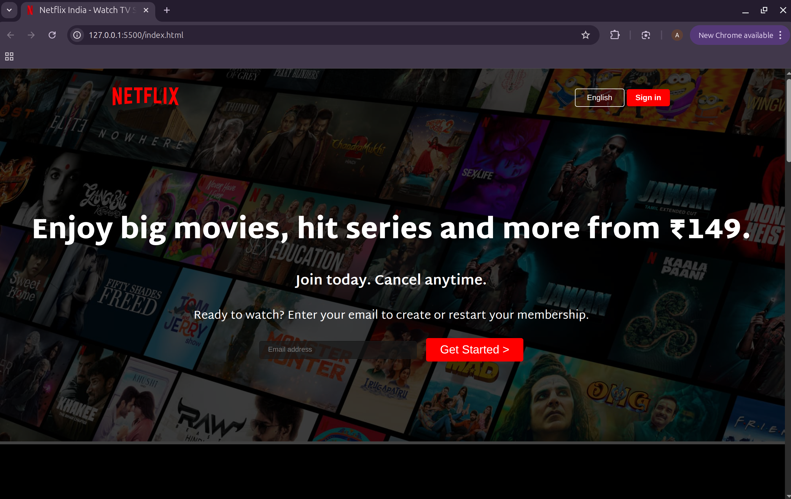

# 🎬 Netflix Clone - Responsive Landing Page

<div align="center">
  
</div>


---

## 🔥 Live Preview
👉 https://netclonix.netlify.app/

---

---

# 📖 About The Project

A fully responsive **Netflix Landing Page Clone** built using **HTML5** and **CSS3**.

This project recreates the modern Netflix homepage interface with:

- Hero banner section
- Responsive navigation bar
- Feature showcase sections
- Embedded videos
- FAQ section
- Responsive footer

The UI closely resembles the official Netflix India landing page.

---

# 🚀 Features

- 🎥 Netflix-inspired modern UI
- 📱 Fully responsive design
- 🖥️ Hero section with overlay
- 🎬 Embedded autoplay videos
- ❓ Interactive FAQ hover effects
- 📧 Email signup section
- 🧭 Responsive navbar
- 📺 TV showcase animations
- ⚡ Smooth layout transitions

---

# 🛠️ Built With

- HTML5
- CSS3
- Google Fonts
- SVG Icons
- Responsive Design using Media Queries

---

# 📂 Project Structure

```bash
Netflix-Clone/
│
├── index.html
├── style.css
│
├── assets/
│   ├── images/
│   │   ├── bg.jpg
│   │   ├── logo.svg
│   │   └── netflix-clone.png
│   │
│   └── videos/
│
└── README.md
```

---

# 🎨 Sections Included

## 🏠 Hero Section

- Background image overlay
- Netflix branding
- Call-to-action buttons
- Email input field

---

## 📺 TV Experience Section

Displays TV streaming experience using:

- TV image
- Embedded autoplay video

---

## 📥 Offline Download Section

Showcases downloading feature with responsive image layout.

---

## 🌍 Watch Everywhere Section

Highlights multi-device streaming support.

---

## 👦 Kids Profile Section

Dedicated kids experience feature section.

---

## ❓ FAQ Section

Contains commonly asked Netflix questions with hover effects.

---

# 📱 Responsive Design

This project is fully responsive and adapts to:

- Desktop screens
- Tablets
- Mobile devices

Implemented using CSS media queries.

```css
@media screen and (max-width: 1300px) {
  .first {
    flex-wrap: wrap;
  }
}
```

---

# 🎬 UI Highlights

- Dark Netflix theme
- Smooth section spacing
- Responsive typography
- Overlay effects
- Hover animations
- Video inside device mockups

---

# 💻 How To Run

## 1️⃣ Clone Repository

```bash
git clone https://github.com/your-username/netflix-clone.git
```

---

## 2️⃣ Open Project

Open:

```bash
index.html
```

inside your browser.

---

# 📚 Learning Outcomes

This project helps in understanding:

- Responsive Web Design
- Flexbox Layout
- CSS Grid
- Positioning
- Overlay Effects
- Media Queries
- Modern Landing Page Design

---

# 🔥 Future Improvements

- 🌙 Dark/Light mode toggle
- 🎞️ FAQ accordion functionality using JavaScript
- 🔐 Authentication pages
- 🎬 Movie carousel sliders
- 📱 Enhanced mobile optimization
- ⚡ Smooth animations with JavaScript

---

# 👩‍💻 Author

Made with ❤️ by **Amisha Patel**

---

# ⭐ Support

If you liked this project:

- Give it a ⭐ on GitHub
- Fork the repository
- Share it with others

---


